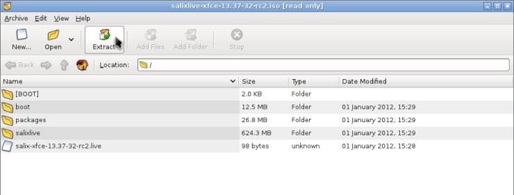
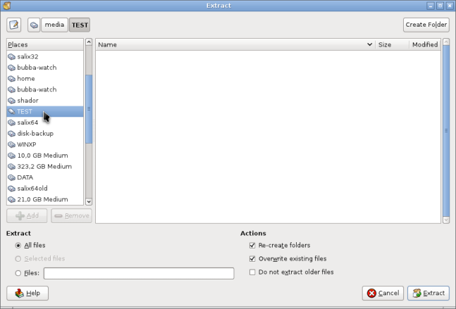
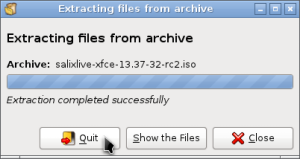
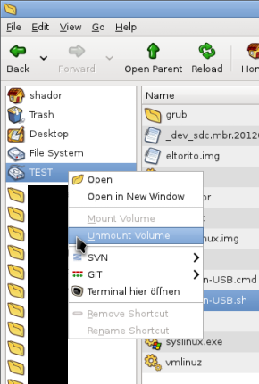

**These instructions are for LiveCD images of Salix only!!!** If your
iso image file does not have *'live'* in it's name look at these
instructions:
[Install-from-USB](/user/install-from-usb)

It depends if you already have a Salix Live CD or simply an ISO image.
**Unetbootin version < 575** is not supported and should not be
used. Versions greater or equal to **575** have been reported to
correctly deal with USB installation and persistence; however it does
not seem to work for all users. In that case, use the script in the boot
directory as described below.

These mostly automatized methods to install the LiveCD to an USB only
support sticks formatted as **FAT** (FAT16, FAT32, VFAT), as supported
by syslinux, and a **MBR** partition table (no GPT). If you don't know
what this means, you most probably have such a stick. Other setups are
very uncommon and require you to do all the work manually.

If you have any important data on the stick, please do create a
**backup** before continuing! Although we've carefully written those
scripts to protect your data, we make no guarantees whatsoever.

## From a Salix Live CD

1.  Boot a Live session from the CD.
2.  Insert your USB key.
3.  Use LiveClone.

## From an ISO image

1.  You need to at least install parted and syslinux. Installation of
    lilo is optional, but highly recommended.
2.  Open the ISO file using a software archiver (file-roller, xarchiver,
    7-zip, iso-master, …)
3.  Extract all files and folders (boot, packages, salixlive
    and salix-&lt;...&gt;.live) to your USB root directory
4.  Go to the "boot" directory on the USB key.
    -   If you're on Unix (Linux, BSD, Max OS X), simply execute the
        file called "install-on-USB.sh" (root privileges are required)
    -   If you're on Windows, execute the file called
        "install-on-USB.cmd" instead.

### Walkthrough with file-roller on Linux

This is to give you a more precise idea how it's done. We're assuming
you're using file-roller as your default archive manager and Thunar as
your file manager, but for other tools like xarchiver it should work
quite similarly. If you have such other tools don't be surprised if the
screenshots are not exactly what you're seeing. ;)

1.  The script requires parted and syslinux to be installed - lilo is
    also highly recommended. If installation to USB is unsuccessful,
    this is the first thing to check using your existing distro's
    package manager.
2.  Browse to the directory where you downloaded the ISO image file to
    and open it by double-clicking. This should bring up your default
    archive manager.
3.  Now select the *Extract* button.
    
4.  In the popping up dialog window select your USB stick in the
    left column. For me it's "TEST". If the USB Stick doesn't show up,
    try opening it first in your regular file manager. Also make sure
    that the same tickboxes/radio buttons are selected in the bottom of
    the window (Extract "All files", "Re-create folders" and "Overwrite
    existing files").\
    
5.  Now press the *Extract* button and wait until the operation
    is finished. If it is, press the *Quit* button.\
    
6.  Open your file manager and navigate to your USB stick. Open the boot
    directory in the root of your stick.
7.  Start the installation by double-clicking the install-on-USB.sh
    script.\
    
8.  You need to enter your root password because administrative
    privileges are required.\
    
9.  Now follow the on-screen instructions. It should be safe to always
    say yes, after checking whether the right devices have been chosen.
    Finally you should end up like this:\
    
    If you end up getting a error message, first try to make some sense
    out of it. You might be missing one of the utilities mentioned
    before (syslinux, parted, lilo).
10. **IMPORANT!!!** Be sure to unmount your stick and to wait for it to
    become really unmounted after all data has been written onto
    the device. Don't unplug it before it's really unmounted. For Thunar
    and many other file managers unmounting works by right-clicking onto
    the device in the left-hand panel.\
    
11. If the stick is really unmounted and all data has been written, this
    is somehow indicated. For example by graying out the device. Now you
    may safely unplug your stick if you want.\
    
12. Done! Now reboot with your stick plugged in and select it as the
    boot device for your BIOS.\
    Many BIOS offer a Boot Selection Menu for this task, which is
    accessible for example by pressing *F12*. Otherwise you might have to enter
    your BIOS Setup and change the boot device order/priority.

## Troubleshooting

### Early failures (i.e. not reaching the Live bootmenu)

This is often caused by various problems with the partitioning/MBR of
USB sticks.

**Before continuing please back up all data on any partition of the
stick because we're going to delete all of it next! Also be sure you've
got the right device name for your stick (e.g. /dev/sdb and not
/dev/sdb1)! If you accidentally use the wrong device the data on it
could be permanently LOST!** To check the device name open the stick in
your file manager and consult the output of the *mount* command. Another
useful utility here can be *blkid*. Later this device name is referred
to as <devname> and should be replaced by whatever you found out.

1.  First, be sure to unmount the stick in your file manager or wherever
    else it is mounted.
2.  Now run this to clean the stick up:
```
dd if=/dev/zero of=<devname> bs=512 count=4096
```
3.  Now start GParted and select to create a new disklabel. It should be
    a msdos one.
4.  Finally create one partition as you like.
5.  Apply the changes and replug the stick to your computer. It should
    now show up again in your file manager and you can install Salix
    Live as by the instructions above again.

If the problem persists ask for help in the Salix forum.

### install-on-USB.sh does not run correctly

1.  Open a terminal and become root
2.  Type `mount` to check where the stick is mounted, for instance,
    something like `/run/media/{youruser}/{very long Hex number}`
```
cd /run/media/foo/bar/boot # replace 'foo' and 'bar' with the appropriate username and number
```
3.  Run the script specifying the shell:
```
sh ./install-on-USB.sh
```

If that still does not work, you may need to mount the stick manually.
First, find out the stick's partition and where it is currently mounted
as above, and make sure no directory under that mountpoint is open
(close the file manager and any other terminal windows); then, as root:

1.  Unmount the stick:
```
umount <partition name> \# e.g. /dev/sdb1
```
2.  Create a directory to mount the stick to, remount it, and move to
    its /boot directory:
```
mkdir /tmp/livemount
mount -t vfat -o exec /dev/sdb1 /tmp/livemount
cd /tmp/livemount/boot
```
3.  For good measure, make sure the script is executable, then run it:\
```
chmod +x ./install-on-USB.sh
sh ./install-on-USB.sh
```
4.  Answer yes to the questions.

If you still have trouble, please ask on the forum.

